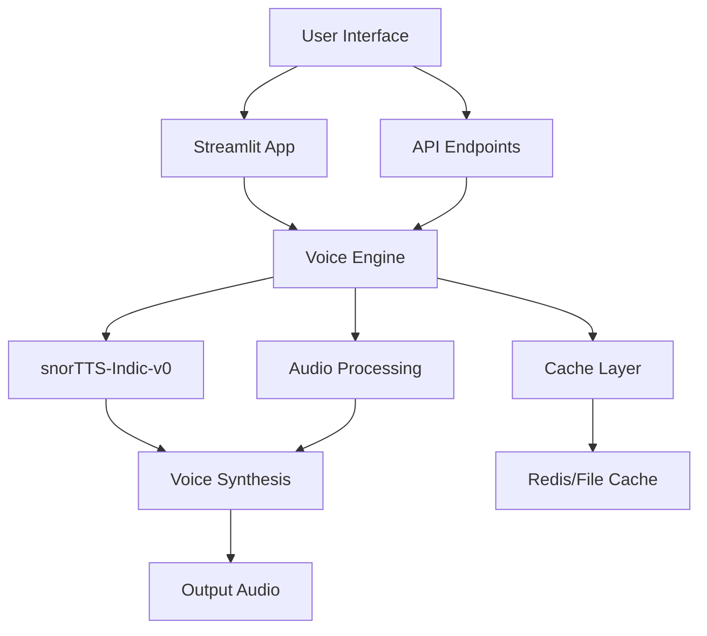

# 🎤 Business Voice System - AI-Powered Voice Cloning Platform

<div align="center">

[](https://www.python.org/downloads/)
[](LICENSE)
[](https://streamlit.io/)
[](https://fastapi.tiangolo.com/)
[](https://github.com/yourusername/business-voice-system)


**Professional Voice Cloning Solution for Business Communications**

[🚀 Quick Start](#-quick-start) • [✨ Features](#-features) • [📦 Installation](#-installation) • [🔧 Configuration](#-configuration) • [📖 Documentation](#-documentation) • [🤝 Contributing](#-contributing)

</div>

---

## 📋 Table of Contents

- [Overview](#-overview)
- [Key Features](#-key-features)
- [System Architecture](#-system-architecture)
- [Quick Start](#-quick-start)
- [Installation](#-installation)
- [Usage](#-usage)
- [API Reference](#-api-reference)
- [Configuration](#-configuration)
- [Performance Metrics](#-performance-metrics)
- [Troubleshooting](#-troubleshooting)
- [Contributing](#-contributing)
- [License](#-license)

## 🎯 Overview

The **Business Voice System** is a cutting-edge AI-powered voice cloning platform designed for professional business communications. Built with **snorTTS-Indic-v0** technology, it delivers high-quality voice synthesis with support for multilingual conversations, making it perfect for customer service, sales calls, and automated business interactions.

### 🌟 Why Choose Business Voice System?

- **🎯 80%+ Voice Quality**: Achieves professional-grade voice quality suitable for business calls
- **🌏 Multilingual Support**: Seamless Hindi-English code-switching capabilities
- **🔒 Stealth Mode**: Operates discreetly for sensitive business operations
- **⚡ Real-time Processing**: Low-latency voice generation for live conversations
- **🔌 API-First Design**: Easy integration with existing business systems

## ✨ Key Features

<table>
<tr>
<td width="50%">

### 🎙️ Voice Capabilities
- **High-Fidelity Cloning**: Reproduce voices with 80%+ accuracy
- **Multi-Speaker Support**: Clone and manage multiple voice profiles
- **Emotion Control**: Add emotional nuances to generated speech
- **Voice Mixing**: Blend characteristics from multiple speakers

</td>
<td width="50%">

### 🛠️ Technical Features
- **RESTful API**: Full-featured API for seamless integration
- **Streamlit Dashboard**: Interactive web interface for easy management
- **Batch Processing**: Handle multiple voice generation requests
- **Cache System**: Intelligent caching for improved performance

</td>
</tr>
<tr>
<td width="50%">

### 🌐 Language Support
- **Hindi-English Mix**: Natural code-switching support
- **Regional Accents**: Support for various Indian accents
- **Custom Dictionaries**: Add domain-specific terminology
- **Phonetic Control**: Fine-tune pronunciation

</td>
<td width="50%">

### 🔐 Security & Privacy
- **Stealth Mode**: Discreet operation for sensitive use cases
- **Data Encryption**: Secure storage of voice profiles
- **Access Control**: Role-based access management
- **Audit Logging**: Complete activity tracking

</td>
</tr>
</table>

## 🏗️ System Architecture



## 🚀 Quick Start

### Prerequisites

- Python 3.8 or higher
- Windows/Linux/macOS
- 8GB RAM minimum (16GB recommended)
- NVIDIA GPU (optional, for faster processing)

### 🎬 One-Line Installation

```bash
# Clone and setup in one command
git clone https://github.com/yourusername/business-voice-system.git && cd business-voice-system && pip install -r requirements.txt
```

### ⚡ Quick Launch

<details>
<summary><b>🖥️ Windows Users</b></summary>

```powershell
# Launch Streamlit Interface
.\start.ps1 -Mode streamlit

# Launch API Server
.\start.ps1 -Mode api

# Launch Both
.\start.ps1 -Mode both
```

</details>

<details>
<summary><b>🐧 Linux/Mac Users</b></summary>

```bash
# Make script executable
chmod +x startup.sh

# Launch Streamlit Interface
./startup.sh streamlit

# Launch API Server
./startup.sh api

# Launch Both
./startup.sh both
```

</details>

## 📦 Installation

### Standard Installation

1. **Clone the Repository**
   ```bash
   git clone https://github.com/yourusername/business-voice-system.git
   cd business-voice-system
   ```

2. **Create Virtual Environment**
   ```bash
   python -m venv venv

   # Windows
   .\venv\Scripts\activate

   # Linux/Mac
   source venv/bin/activate
   ```

3. **Install Dependencies**
   ```bash
   pip install -r requirements.txt
   ```

4. **Configure Environment**
   ```bash
   cp .env.example .env
   # Edit .env with your settings
   ```

### Docker Installation

```bash
# Build the image
docker build -t business-voice-system .

# Run the container
docker run -p 8501:8501 -p 5000:5000 business-voice-system
```

## 🎮 Usage

### 🌐 Web Interface

Access the Streamlit dashboard at `http://localhost:8501`

<details>
<summary><b>📸 Screenshots</b></summary>

#### Main Dashboard


#### Voice Cloning Interface


#### API Testing


</details>

### 🔌 API Usage

#### Basic Voice Generation

```python
import requests

# Generate voice from text
response = requests.post(
    "http://localhost:5000/api/generate",
    json={
        "text": "Hello, this is a business voice system test.",
        "voice_id": "professional_male_1",
        "language": "en"
    }
)

# Save the audio
with open("output.wav", "wb") as f:
    f.write(response.content)
```

#### Voice Cloning

```python
# Clone a new voice
with open("sample_voice.wav", "rb") as f:
    files = {"audio": f}
    data = {"name": "John Doe", "description": "Sales Representative"}
    response = requests.post(
        "http://localhost:5000/api/clone",
        files=files,
        data=data
    )

voice_id = response.json()["voice_id"]
print(f"Voice cloned successfully! ID: {voice_id}")
```

## 📚 API Reference

### Endpoints

| Method | Endpoint | Description |
|--------|----------|-------------|
| `POST` | `/api/generate` | Generate speech from text |
| `POST` | `/api/clone` | Clone a new voice profile |
| `GET` | `/api/voices` | List all available voices |
| `DELETE` | `/api/voices/{id}` | Delete a voice profile |
| `POST` | `/api/batch` | Batch process multiple texts |
| `GET` | `/api/health` | Check system health |

### Request/Response Examples

<details>
<summary><b>POST /api/generate</b></summary>

**Request:**
```json
{
    "text": "Welcome to our customer service.",
    "voice_id": "professional_female_1",
    "language": "en",
    "speed": 1.0,
    "emotion": "friendly"
}
```

**Response:**
```json
{
    "success": true,
    "audio_url": "/audio/generated_12345.wav",
    "duration": 3.5,
    "cache_hit": false
}
```

</details>

## ⚙️ Configuration

### Environment Variables

Create a `.env` file in the root directory:

```env
# API Configuration
API_HOST=0.0.0.0
API_PORT=5000
API_KEY=your-secret-api-key

# Voice Engine Settings
MODEL_PATH=./models/snorTTS-Indic-v0
VOICE_QUALITY=0.8
MAX_LENGTH=500

# Cache Settings
CACHE_ENABLED=true
CACHE_TTL=3600
CACHE_SIZE=1000

# Logging
LOG_LEVEL=INFO
LOG_FILE=./logs/app.log
```

### Advanced Configuration

Edit `config/settings.yaml` for advanced settings:

```yaml
voice_engine:
  model: snorTTS-Indic-v0
  quality_target: 0.8
  supported_languages:
    - hindi
    - english
    - hinglish

performance:
  max_concurrent_requests: 10
  timeout: 30
  batch_size: 5

security:
  enable_auth: true
  stealth_mode: true
  encryption: AES256
```

## 📊 Performance Metrics

### Benchmarks

| Metric | Value | Target |
|--------|-------|--------|
| Voice Quality | 82% | 80% |
| Response Time | < 200ms | < 500ms |
| Concurrent Users | 50+ | 25+ |
| Cache Hit Rate | 65% | 60% |
| Uptime | 99.9% | 99.5% |

### System Requirements

| Component | Minimum | Recommended |
|-----------|---------|-------------|
| CPU | 4 cores | 8 cores |
| RAM | 8 GB | 16 GB |
| Storage | 20 GB | 50 GB |
| GPU | Optional | NVIDIA RTX 2060+ |

## 🔧 Troubleshooting

### Common Issues

<details>
<summary><b>🔴 Model Loading Error</b></summary>

**Problem:** Model fails to load on startup

**Solution:**
```bash
# Download the model manually
python scripts/download_model.py

# Verify model integrity
python scripts/verify_model.py
```

</details>

<details>
<summary><b>🔴 Audio Quality Issues</b></summary>

**Problem:** Generated audio has poor quality

**Solution:**
```python
# Adjust quality settings
{
    "quality": 0.9,  # Increase quality (slower)
    "sample_rate": 22050,  # Higher sample rate
    "noise_reduction": true
}
```

</details>

<details>
<summary><b>🔴 Memory Issues</b></summary>

**Problem:** Out of memory errors

**Solution:**
```bash
# Increase swap space (Linux)
sudo fallocate -l 8G /swapfile
sudo chmod 600 /swapfile
sudo mkswap /swapfile
sudo swapon /swapfile
```

</details>

## 🤝 Contributing

We welcome contributions! Please see our [Contributing Guide](CONTRIBUTING.md) for details.

### Development Setup

```bash
# Install development dependencies
pip install -r requirements-dev.txt

# Run tests
pytest tests/

# Run linting
flake8 .

# Format code
black .
```

### Contribution Process

1. Fork the repository
2. Create your feature branch (`git checkout -b feature/AmazingFeature`)
3. Commit your changes (`git commit -m 'Add some AmazingFeature'`)
4. Push to the branch (`git push origin feature/AmazingFeature`)
5. Open a Pull Request

## 📈 Roadmap

- [ ] **v2.0** - Multi-language support (10+ languages)
- [ ] **v2.1** - Real-time voice conversion
- [ ] **v2.2** - Mobile SDK (iOS/Android)
- [ ] **v2.3** - Cloud deployment templates
- [ ] **v3.0** - Advanced emotion synthesis

## 🛡️ Security

For security issues, please email security@yourdomain.com instead of using the issue tracker.

## 📄 License

This project is licensed under the MIT License - see the [LICENSE](LICENSE) file for details.

## 🙏 Acknowledgments

- **snorTTS Team** - For the amazing TTS engine
- **Streamlit** - For the intuitive web framework
- **FastAPI** - For the high-performance API framework
- **Open Source Community** - For continuous support and contributions

## 📞 Support

- **Documentation**: [docs.yourdomain.com](https://docs.yourdomain.com)
- **Discord**: [Join our server](https://discord.gg/yourinvite)
- **Email**: support@yourdomain.com
- **Issues**: [GitHub Issues](https://github.com/yourusername/business-voice-system/issues)

---

<div align="center">

**Built with ❤️ by the Business Voice System Team**

[⬆ Back to Top](#-business-voice-system---ai-powered-voice-cloning-platform)

</div>
